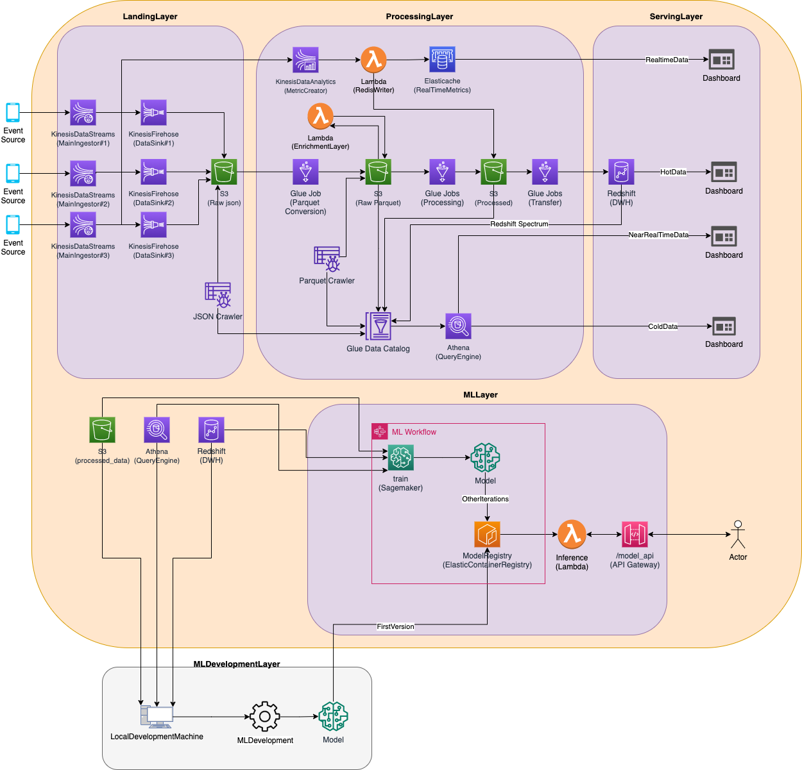
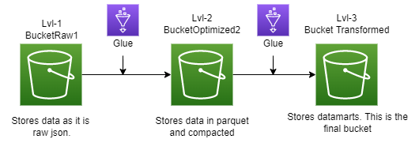

# Click Streaming on AWS

## Problem:
The main aim of this project is to create event tracking data architecture for an international VOD application. 

## Architecture

<br>

<p align="center" width="100%">
    
</p>


### 1- Landing Layer
The first layer of architecture is the landing/ingesting layer. Each event collector pushes data through to Kinesis Data Streams, each data stream has data retention of 7 days.The size of data pushed to our streaming apps is approx 30-50 GB daily.

**BUCKETS:** We have 3 different s3 buckets;

<p align="left" width="100%">
    
</p>

**Firehose:** Each data stream has kinesis firehose sink that pushes data directly to row_json bucket

**Crawlers:** To detect schema changes each event has crawler to populate schemas of data


### 2- Processing Layer
Data is stored, proccessed and catalogged in this step.

**Glue**: We are using glue jobs to transform our data. 

**Athena** : Athena and Glue are really close friends. Once the population of glue tables is done, we can easily use athena for ad-hoc queries. 


### 3-Serving Layer

**Redshift:** We are serving hot data(1 week) with Redshift The query performance of redshift far better then Athena and Spectrum.

**Redshift Specturum:** We are using Redshift Specturum for specific needs such as: Aggregation of hot and cold data(Redshift and S3) 

**Quicksight**

**Tableu**


--
## 🐵 Faced Issues

1- KAFKA MSK Problem

2- Direct parquet conversion within firehose

Firehose has the ability to convert json to parquet directly but we need to create **MANUEL** tables for that. We are unable to create table from glue schema registry or we can not use crawler to  crawl data in kinesis data stream. That is the main reason why we add one more bucket.

3- Glue notebook pricing(devel endpoint)

Need to be careful when  developing glue scripts via Glue notebook. Do not forget to set the conf variables before starting implementation.

```

%number_of_workers 2
%idle_timeout 30
%region eu-central-1
%iam_role arn:aws:iam::000496194717:role/AWS-GLUE-ROLE-VOD-POC
%worker_type G.2X # -->  worker type
# %additional_python_modules s3://path-of-my-module
# %additional_python_modules awswrangler, s3:Mymodule.

```
