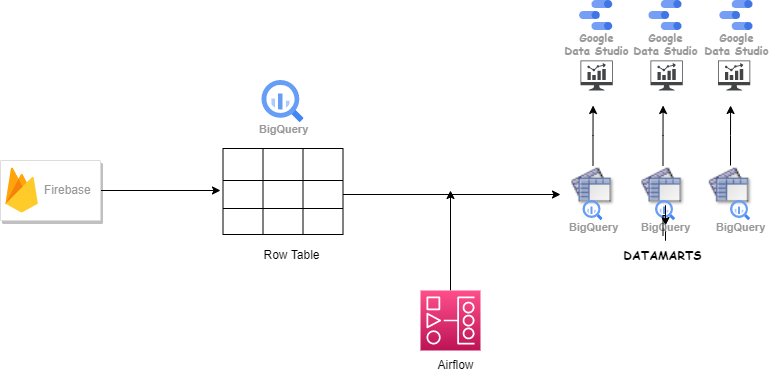
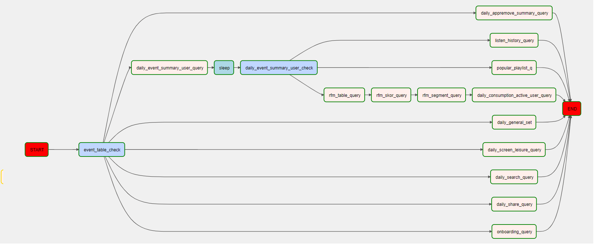

# Datamarts on BQ

## Description:

**Problem**

There were inconsistent data source problem due to firebase integration. Firebase exports daily raw batch data to BigQuery. Data Analysts feeds datamarts using raw table via scheduled queries but incoming data arrival time may change. 

**Solution** :

I solved this problem using Airflow. Because airflow BigQuerySensorOperator and BigQueryCheckOperator can wait table to be filled and also Airflow is one of the best way to orchestrate consecutive jobs.

## Architecture

 

    

## Airflow
Airflow is one of the best data orchestration and scheduliding tool in data world. And the community of airflow has been growing fast for the last few years espacially after **Astronomer**. I did not even need to write any of my own operator or hook. I used built-in `BigqueryCheckOperator`, `PythonOperator` and `BashOperator`. If you have some consecutive jobs needs to wait each other you should definetely use Airflow.

`BigqueryCheckOperator` checks row table within every 30 mins to check whether raw-table are filled or not.Here is the airflow architecture:

 

    

 

## 🐵 Faced Issues

- I can not say this is issue but there is one cruical thing about Airflow is that Using Airflow in cloud is really expensive. I have never had a chance to use astronomer but I have tried GCP Airflow(Google Cloud Composer) and AWS Airflow(AWS MWAA). Both of them was very expensive at that times thus I decided to create Airflow on 1 single instance with LocalExecutor on one of our local Ubuntu 20.04 machines. It's been working good so far. My suggestion is that go with airflow on-prem installation unless you have heavy workloads or high number of dags/tasks. 