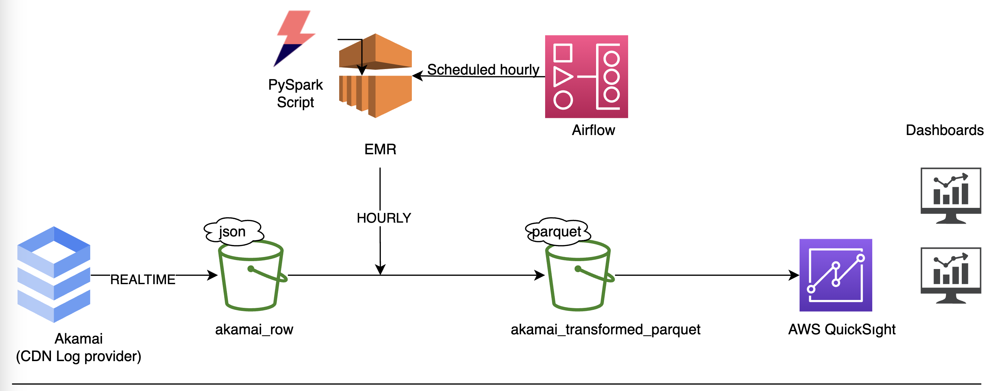

# AkamaiLogAnalysis

## Problem:
The main problem is to analyze CDN Logs provided by AKAMAI. 

## Challanges
CDN data is being produced in realtime. Thus there are at least 10 GB data and at least 4 million small files daily. 

## Architecture

<br>
<p align="center" width="100%">
    

</p>

---
---
<br>
<p align="center" width="100%">
    
</p>

---
---
## SUMMARY

- PYSPARK: When processing big data one of the most important issue is to tune machines and read many small files. In transformation script I tuned shuffled partition number and some other configs.
- AIRFLOW: Airflow is one of the best tool that you can orchestrate your workflow and schedule your jobs. I used task grouping and create one dynamic dag to generate each hourly dags(0-24).Used operators are: https://airflow.apache.org/docs/apache-airflow-providers-amazon/stable/operators/emr.html
- QUICKSIGHT: We used quicksight to visualize data. Quicksight mainly uses athena to query data in S3(or there is a SPICY mode). We already have an AWS quicksight account there is no specific reason why we chose QuickSight but we want to solve this problem natively in AWS. 
- EMR: EMR is an AWS services that builds applications using the latest open-source frameworks, with options to run on customized Amazon EC2 clusters. We are using RunJobFlowOperator to create clust AddStepsOperator to add pyspark job with params.
    
    ```
    spark-submit --deploy-mode client s3://emr-helper/akamai/etl.py {hour}
    ```
